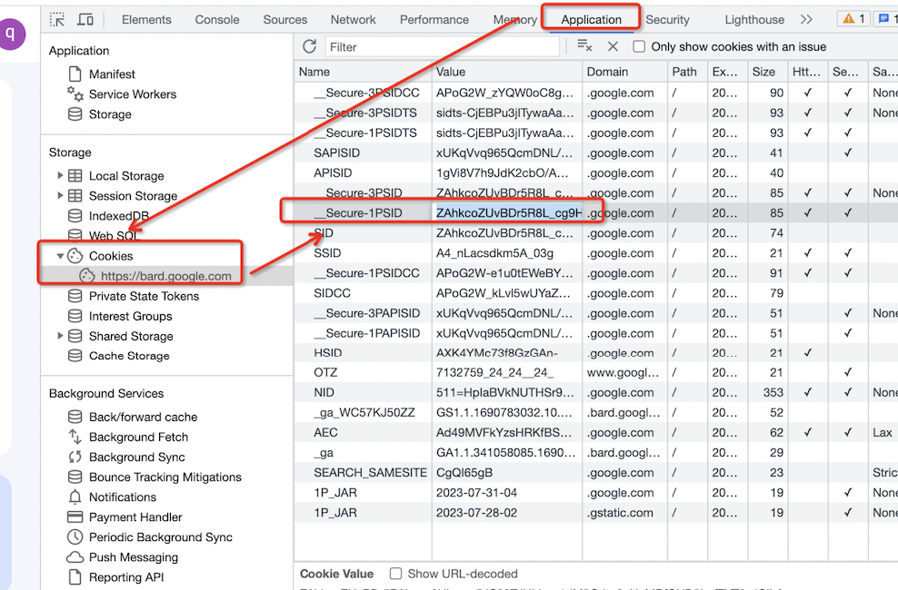

# Bard-Proxy
Proxy for Bard LLM

## How to get your bard key

Access from <a ref="https://bard.google.com/">Bard</a> 

<p align="left">
  
</p>


## Quick Start

### Method 1: Quick Start by Docker 

```commandline
# use your own bard key 'YOUR-BARD-KEY' instead.
docker run -p 8671:8671 -e BARD_PROXY_API_KEY=YOUR-BARD-KEY bard_proxy
```

### Method 2: Start In Current Project
1. set your bard key in .env file
2. start python project
> python main.py

